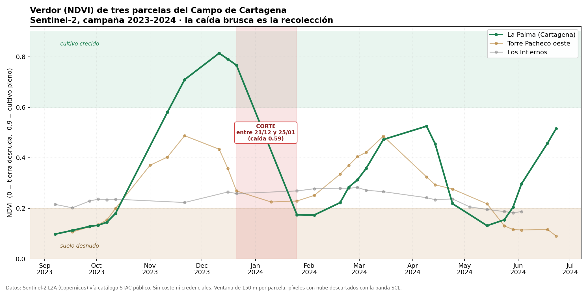
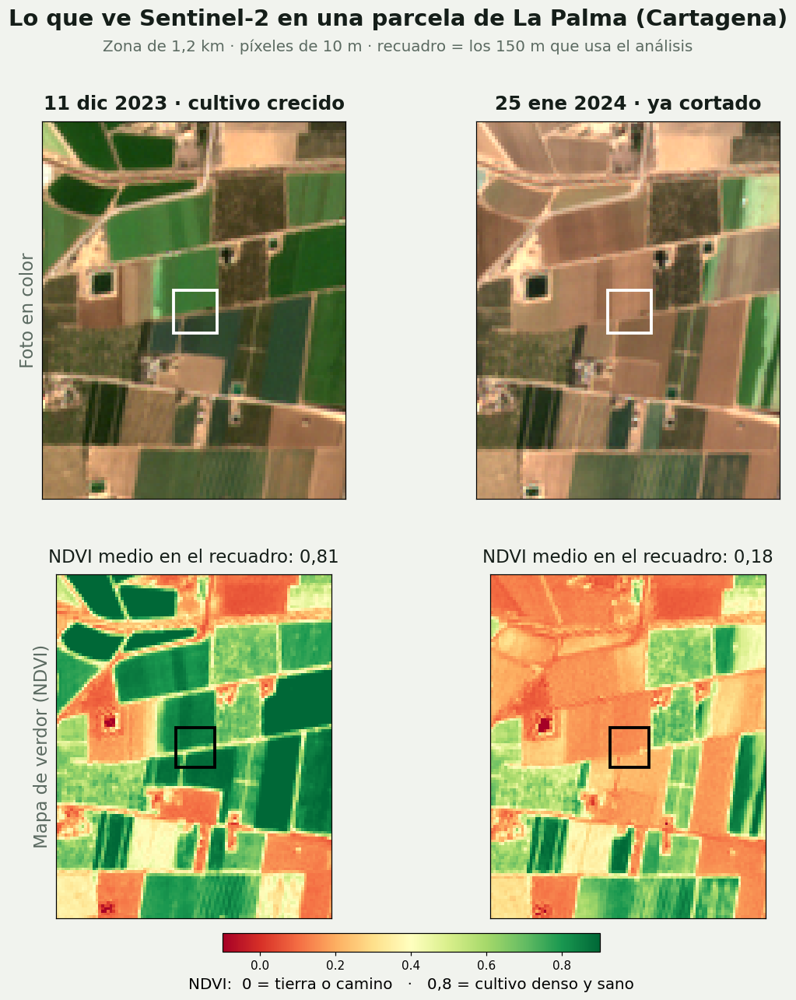

# Ventana de recolección en el Campo de Cartagena

Cuánto se mueve la fecha de corte del brócoli y de la lechuga entre campañas, y cómo detectar ese corte desde satélite.

Investigación abierta y en curso. Aquí está lo que ya se puede medir con datos públicos, con sus límites por delante.

## La pregunta

Una comercializadora de hortícola de invierno planifica con un calendario fijo: «trasplanto la semana 44, recolecto a los 108 días». El clima no sigue ese calendario. La pregunta es cuánto se desvía la realidad térmica de la planificación, y si esa desviación es lo bastante grande como para que merezca la pena predecirla.

## Resultado 1: el calendario fijo falla en los trasplantes de otoño

Integral térmica (grados-día de crecimiento) sobre **19 campañas (2000-2018)** de **5 estaciones agroclimáticas** de la red SIAM del IMIDA, descargadas del portal de datos abiertos de la CARM.

Para cada semana de trasplante se acumula `max(0, (tmax + tmin) / 2 - T_base)` hasta alcanzar el requerimiento del cultivo, y se cuenta cuántos días han hecho falta.

Brócoli (T_base 4,4 °C, 850 GDD):

| Semana de trasplante | Ciclo medio | Mínimo | Máximo | Diferencia |
|---|---|---|---|---|
| 35 (finales de agosto) | 47 días | 40 | 56 | **16 días** |
| 38 | 58 días | 48 | 77 | 29 días |
| 41 | 83 días | 61 | 119 | 58 días |
| 44 (principios de noviembre) | 108 días | 83 | 148 | **65 días** |
| 47 | 116 días | 95 | 142 | 47 días |

El mismo cultivo, trasplantado la misma semana, tardó **83 días un año y 148 otro**. En lechuga el patrón se repite, con hasta 52 días de diferencia en la semana 47.

La lectura: en los trasplantes de finales de verano un calendario fijo funciona razonablemente bien; a partir de octubre deja de funcionar. Y ese es justo el tramo de campaña que abastece el invierno europeo.

## Resultado 2: el corte se ve desde satélite, salvo cuando hay nubes



Series de NDVI de **Sentinel-2 L2A**, obtenidas del catálogo STAC público de Element84 sobre AWS, sin credenciales ni coste. Ventana de 150 m por parcela y píxeles con nube descartados con la banda SCL.

El verdor sube mientras el cultivo crece y se desploma el día que se recolecta. En la parcela de La Palma, la caída va de **0,77 a 0,17** (el máximo de la campaña fue 0,81), y es inconfundible.

El problema está en el mismo dato: entre el **21 de diciembre y el 25 de enero no hubo ni una sola imagen útil** por nubosidad. Se sabe que la parcela se cortó, pero solo dentro de una ventana de **35 días**. Para validar una predicción a 5 días vista, eso no vale.



## Lo que esto todavía no resuelve

1. **Huecos por nubes** de hasta 35 días en pleno invierno, justo en la ventana que interesa. El siguiente paso es probar Sentinel-1, que es radar y ve a través de las nubes.
2. **Parámetros sin calibrar:** las temperaturas base y los requerimientos de grados-día vienen de literatura, no de campo. Sirven para medir el tamaño del problema, no para decidir un corte.
3. **Parcelas elegidas a mano** por coordenadas, en vez de por recintos de SIGPAC, y recortadas como un cuadrado de 150 m en lugar de por su contorno real.
4. **Sin verdad de campo:** falta contrastar contra fechas de corte reales de una campaña.

Mientras esos cuatro puntos sigan abiertos, esto mide el problema; no lo predice.

## Fuentes de datos

| Fuente | Qué aporta | Acceso |
|---|---|---|
| Red SIAM del IMIDA (CARM) | Serie diaria de temperaturas, 2000-2018 | Datos abiertos, CKAN |
| Sentinel-2 L2A (Copernicus) | Verdor (NDVI) cada ~5 días | Catálogo STAC público, sin credenciales |
| Open-Meteo (archivo histórico) | Cubre el hueco posterior a 2018 del SIAM | API pública |

Los CSV abiertos del SIAM llegan solo hasta 2018: el portal `siam.imida.es` no expone descarga masiva pública. Para un modelo climatológico, 2000-2018 es suficiente.

## Estructura

```
src/descargar_siam.py   Descarga las estaciones del Campo de Cartagena y sus series diarias
src/analisis_gdd.py     Integral térmica por semana de trasplante (tabla de arriba)
src/serie_ndvi.py       Serie NDVI de una parcela desde Sentinel-2, con máscara de nubes
src/grafico_ndvi.py     Gráfico de las tres parcelas y detección de la caída de corte
src/ver_ndvi.py         Foto en color y mapa NDVI, antes y después del corte
datos/estaciones.csv    Estaciones de la red SIAM
datos/series_ndvi.csv   Series NDVI ya calculadas (caché)
```

## Cómo ejecutarlo

```bash
pip install -r requirements.txt
cd src
python descargar_siam.py   # descarga las series diarias del SIAM
python analisis_gdd.py     # tabla de ciclos por semana de trasplante
python grafico_ndvi.py     # gráfico de verdor y detección del corte
```

Las series diarias del SIAM no están en el repositorio: las descarga el primer script.

## Siguiente paso

Pasar de medir el problema a predecirlo: incorporar Sentinel-1 para tapar los huecos de nubes, seleccionar parcelas por SIGPAC y calibrar contra fechas de corte reales de una campaña.

Si planificas recolecciones en el Campo de Cartagena y esto te suena a tu día a día, me interesa mucho tu opinión. Escríbeme por LinkedIn: [linkedin.com/in/samuel-escribano-garcia](https://www.linkedin.com/in/samuel-escribano-garcia/)

---

Datos climáticos: IMIDA, red SIAM, portal de datos abiertos de la Región de Murcia. Imágenes: Copernicus Sentinel-2.
